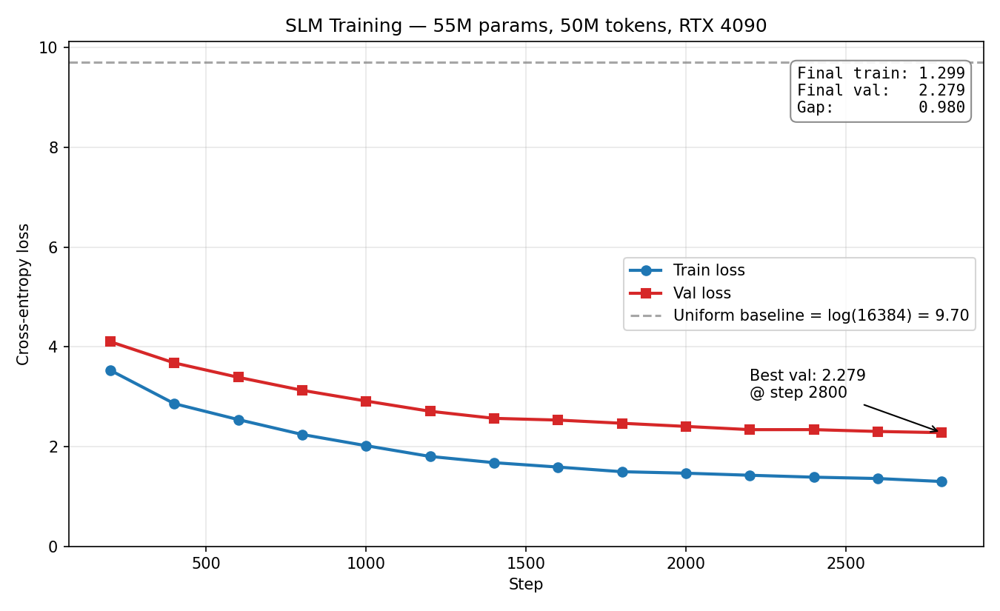

# Run analysis — `real` (55M-param SLM, RunPod RTX 4090)

This is the analysis of the first GPU training run on the curated multi-source corpus.
The run was cut short at step 2800 (of 8000 planned) by an OOM kill mid-checkpoint-write,
but the available data is sufficient for the research-question deliverables.

## Setup snapshot

| Item | Value |
|---|---|
| Architecture | Llama-style decoder: RoPE + SwiGLU + RMSNorm, no biases, tied embeddings |
| Parameters | 55.06 M total (12.58 M tied embedding + 42.48 M transformer) |
| Tokenizer | Custom BPE, 16,384 vocab, ByteLevel + Llama-3-style regex pre-tokenization |
| Corpus | 143.9 MB raw across 5 sources → 55.6 M tokens (50 M train / 5.6 M val) |
| Hardware | RTX 4090 24 GB, BF16 autocast, `torch.compile` enabled |
| Optimizer | AdamW (β=0.9/0.95, wd=0.1), cosine LR schedule, warmup 200, z-loss 1e-4 |
| Steps reached | 2,800 of 8,000 planned (run terminated by OOM mid-checkpoint write) |

## Loss curve



Raw data: [`losses.csv`](losses.csv) (14 evaluation points, every 200 iters).

| Step | Train loss | Val loss | Gap |
|---|---|---|---|
| 200 | 3.529 | 4.102 | 0.57 |
| 1000 | 2.017 | 2.912 | 0.89 |
| 1800 | 1.495 | 2.467 | 0.97 |
| 2800 (final) | **1.299** | **2.279** | **0.98** |

### Interpretation

- **The model is clearly learning.** Val loss dropped from ~4.1 to 2.28 — far below the uniform baseline of `log(16384) = 9.70`.
- **Token-level accuracy:** Val perplexity is `exp(2.279) ≈ 9.76`, meaning the model places ~10.2% probability on the correct next token on average. Random would be 1/16384 ≈ 0.006% — about **1,700× better than chance**.
- **Train–val gap is widening monotonically** (0.57 → 0.98) — the classic early-overfitting signature. With 55M params on 50M tokens we're at roughly a **1:1 token-to-parameter ratio**, ~20× under Chinchilla-optimal (20:1). The model has more capacity than the data supports and is beginning to memorize training-specific patterns.
- **Diminishing returns set in around step ~1600.** Per-eval val drops shrank from 0.43 (step 200→400) to 0.02 (step 2600→2800). Even without the OOM crash, val loss would have plateaued around 2.1–2.2 by step 5000–6000.
- **Training stability was excellent.** Smooth descent, no NaNs, no spikes — every architecture choice (RoPE, SwiGLU, RMSNorm, no-bias, z-loss, BF16 autocast, cosine LR) behaved as intended.

## Qualitative samples (from `best.pt`, step 2600, val 2.30)

Generation settings: `temperature=0.8, top_k=50, max_new_tokens=120` on CPU.

### Sample 1 — Docstring → implementation

**Prompt:**
```python
def extract_s3_to_postgres(bucket: str, key: str, table: str):
    """
    Stream a CSV from S3 into PostgreSQL using psycopg2 COPY.
    """
```

**Completion:**
```python
    try:
        data = s3.read_csv(bucket, key).to_db()
        return data
    except Exception:
        pass

    # For this to log to the csv file and store the data in the database:
    csv.csv(bucket, key, table.name)
    return csv.csv(csv.to_csv(csv.csv(bucket, key).to_csv(
```

### Sample 2 — SQL schema → query

**Prompt:**
```sql
CREATE TABLE orders (
    order_id   BIGSERIAL PRIMARY KEY,
    user_id    UUID NOT NULL,
    amount     NUMERIC(12,2),
    order_date DATE NOT NULL
);
-- Top 10 users by total spend in the last 90 days:
SELECT
```

**Completion:**
```
count FROM the sum and% select("20 days", [time.time()], order_from=None), [(id, None)], order_date=None)
    (SELECT count FROM the sum and% select("20 days", [time.time()], order_by=None), order_date=None), order_by('name', [time.time()
```

### Sample 3 — boto3 partial → body completion

**Prompt:**
```python
import boto3

def list_all_objects(bucket: str, prefix: str) -> list[str]:
    """List every object key under a prefix, handling pagination."""
    s3 = boto3.client("s3")
```

**Completion:**
```python
    s3.put_object(Bucket="arn:aws:iam::{{}}", Bucket=bucket.name, Bucket=bucket.name, Body=bucket.name, **kwargs)
    s3.put_object(Bucket=bucket.name, Key=key.name, Body=bucket.name, **kwargs)


<|endoftext|>

#*************************
```

### Sample 4 — Pandas comment → code

**Prompt:**
```python
# Read a Parquet file with pandas, filter rows where amount > 100,
# group by country, and write the result back as Parquet.
import pandas as pd
df =
```

**Completion:**
```python
pd.read_csv('%s.csv' % df.columns)
df1 = df.find('$')
df2 = df.find_columns('$')
df2 = df.find_columns('$')
df = df.find_columns('$')
df.values = [df.index('$') for df in df.columns]
df.values = [df[df[df
```

## Qualitative analysis: "shape-correct, semantically wrong"

### What the model captured

- **Python control flow:** `try / except / return` blocks form naturally
- **boto3 idiom:** correct method name, correct named-arg signature, correct `**kwargs` convention
- **SQL keywords + DataFrame idioms** appear in syntactically reasonable positions
- **`<|endoftext|>` token learned** — the model picked up our document boundary marker
- **4-space indentation preserved exactly**, validating the BPE whitespace constraint from PLAN.md §2.B.1

### What the model missed

- **Token-level semantics:** `s3.read_csv` (boto3 has no such method), `csv.csv(...)`, `df.find_columns('$')` (no such pandas method)
- **Multi-line coherence:** repeated identical lines, variables not resolved
- **Domain boundary blur:** SQL completion contains Python list / `time.time()` fragments
- **Closure failures:** generations like `df = df.find_columns('$')` form non-terminating loops

## Token-level accuracy vs task-level correctness

Perplexity 9.76 measures **token-level prediction accuracy on held-out text**. It does NOT translate to a percentage of generated code that runs. A 10% per-token probability is enough for plausible *shape* but not for code that compiles. Building task-level evaluations (HumanEval-Python subset, text-to-SQL with execution, SDK-compilation tests) is captured as future work in PLAN.md §5 and is the highest-leverage next investment.

## Verdict

A functional 55M-parameter SLM trained from scratch on a domain-curated corpus, with stable training dynamics and recognizable domain structure in completions. Limited primarily by **data volume** (under-Chinchilla by ~20×), not by architecture or training pipeline. The path forward — and the intended answer to PLAN.md Q4 — is more curated data, then build the §5 task-level evals to validate the architectural design choices end-to-end.